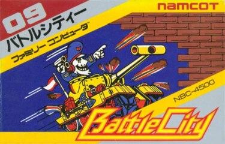
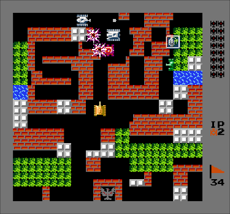

# Description
## Gameplay
The player controls a tank and shoots projectiles to destroy enemy tanks around the playfield. The enemy tanks enter from the top of the screen and attempt to destroy the player's base (represented on the screen as a phoenix symbol), as well as the player's tank itself. A level is completed when the player destroys 20 enemy tanks, but the game ends if the player's base is destroyed or the player loses all available lives. Note that the player can destroy the base as well, so the player can still lose even after all enemy tanks are destroyed.

Battle City contains 35 different stages that are 13 units wide by 13 units high. Each map contains different types of terrain and obstacles. Examples include brick walls that can be destroyed by having either the player's tank or an enemy tank shoot at them, steel walls that can be destroyed by the player if they have collected three stars, forest that hides tanks in them, ice fields that make it difficult to control the tank and patches of water which cannot be crossed by tanks. In addition, flashing red tanks drop power-ups when destroyed. There are several types of power-ups, such as a clock that freezes all enemies, a protective shield, and a bomb that eliminates all on-screen enemies. The enemy tanks come in four different sizes, with the largest one requiring four shots to destroy.

## Controls
**Esc** - exit game.  
**Pause** - pause game.  
**Arrow keys** - movement.  
**Space** - fire.  
**PageUp** - reset (if game over) or next level (resets score).  
**PageDown** - reset (if game over) or previous level (resets score).  
**M** - mute/unmute (starts muted).  

# Installation
## Pre-compiled binary
Download archive for your platform from latest [release](https://github.com/gunnerson/battlecity/releases/), extract and launch.

## Arch Linux
From AUR with your favourite helper, for example `yay -S battlecity-git`

## CLI
1. Clone the repository `git clone https://github.com/gunnerson/battlecity.git`
2. Change directory `cd battlecity`
3. Create build directory `mkdir build` and switch to it `cd build`
3. Generate native build system `cmake ..`
4. Compile the project `cmake --build .` 
5. The executable is generated at `bin/` directory.

### One-liner
```
git clone https://github.com/gunnerson/battlecity.git && cd battlecity && mkdir build && cd build && cmake .. && cmake --build . && cd bin
```

# Progress
- [x] Window generation
- [x] Sprites
- [x] Base
- [x] Game cycle
- [x] Brick walls
- [x] Steel walls
- [x] Forest
- [x] Water
- [x] Ice
- [x] Tanks
- [x] Projectiles
- [x] Collisions
- [x] AI
- [x] Upgrades
- [x] Score board
- [x] All 35 levels
- [x] Sounds
- [ ] Start menu
- [ ] Begin stage animation
- [ ] End stage animation

