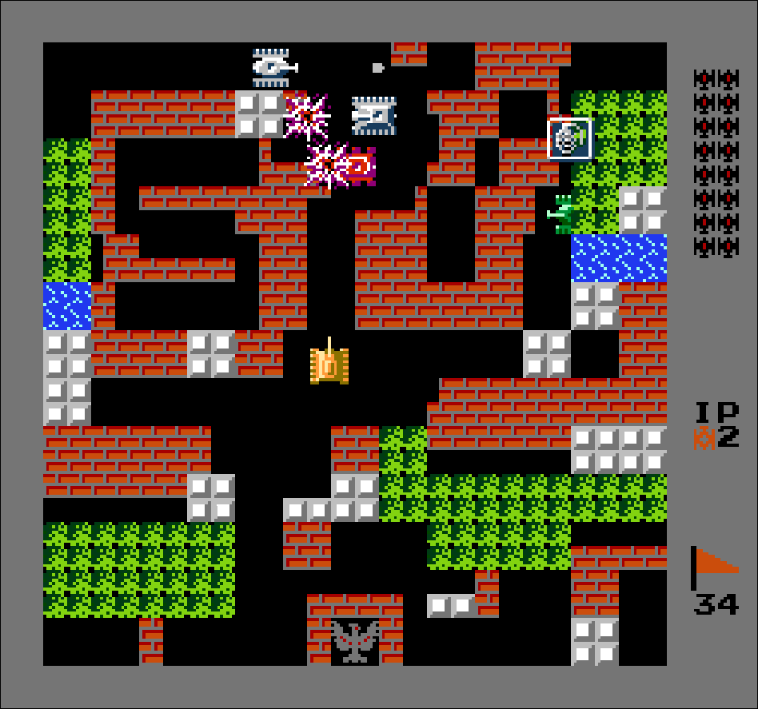

# Installation
## Linux
1. Clone the repository `git clone https://github.com/gunnerson/battlecity.git`
2. Change directory `cd battlecity`
3. Install [CMake](https://cmake.org/download/) if not already and generate native build system `cmake .`
4. Compile the project `cmake --build .` 
5. On author's machine it generated the executable at `./bin/main`

# Progress
- [x] Window generation
- [x] Sprites
- [x] Base
- [x] Game cycle
- [x] Brick Walls
- [x] Steel Walls
- [ ] Forest
- [ ] Water
- [ ] Ice
- [x] Tanks
- [x] Projectiles
- [x] AI
- [ ] Bonuses
- [ ] All Levels
- [ ] Start Menu
- [ ] Score board
- [ ] Sounds

